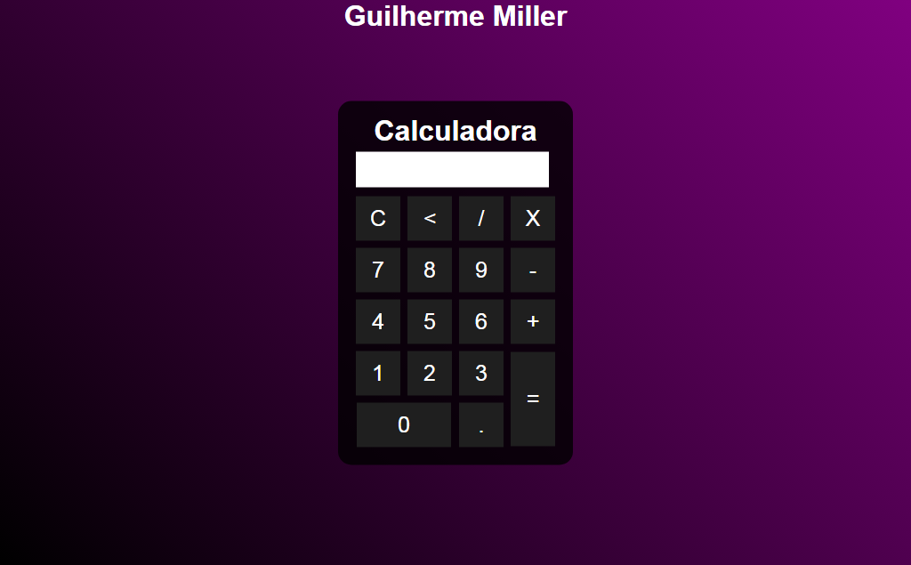

# Calculadora

> Calculadora JS

Nesse projeto criei uma calculadora com intuito de aprender mais a linguagem JavaScript.

## Tecnologias

- HTML
- CSS
- JavaScript
- Git e Github

## O que aprendi

- Aumentar linhas e colunas dos botões com colspan e rowspan
- Usar a função eval para os cálculos da calculadora

## Contato

guilhermemillerblack@gmail.com